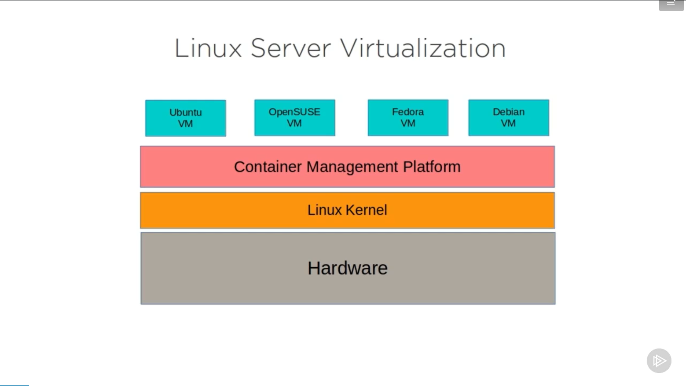

# **4 Configuring the Linux Environment**

```bash
df -ht ext4

# Hiển thị tất cả các thiết bị khối hiện được gắn trên hệ thống.
# -h : định dạng size (GB)
# -t : type, in is ext4
```

```bash
lsblk | grep sd

# Xem tất cả các thiết bị khối được gắn vào hệ thống vật lý
```

```bash
sudo mount /dev/sdb2 /media/newplace

# dev/sdb2 là một phân vùng
# /media/newplace/ là thư mục muốn sử dụng phân vùng ấy
```

```bash
dmesg
dmesg | grep wl
dmesg | wc

# Hiển thị các thông báo liên quan đến bộ đệm vòng kernel
```

```bash
sudo lshw | less

# Hiển thị thông tin phần cứng bao gồm, core, cpu, ram, ...
# Phải apt install lshw (vì lshw không có sẵn)
```

```bash
yum install lshw
```

## Summary

```bash
less /etc/default/grub
systemctl enable multi-user.target
localectl set-locale LANG=en_CA.utf8
export myVar
df -ht ext4
lsblk | grep sd
dmesg
```

# **5 Configuring the linux desktop experience**

## **5.1 Working with linux software repositories**

### Distribution Families

- Debian: Ubuntu, Mint, and Kali Linux
  - Using: apt, apt-get, dpkg
- Red hat Enterprise Linux: CentOS and Fedora
  - Using: yum, rpm (dnf)
- Suse: OpenSuse
  - Using: ZYpp
- Arch Linux: LinHES and Manjaro
  - Using: pacman

### Ubuntu software repositories

- **Main:** Supported by Canonical, Các gói cài đặt được Canonical hỗ trợ chính thức và chỉ bao gồm phần mềm nguồn mở.
- **Restricted:** Proprietary, Các gói hạn chế được hỗ trợ chính thức nhưng được xây dựng với phần mềm mã nguồn đóng, Propietary graphics drivers ( trình điều khiển đồ họa ) thường thuộc loại này.
- **Universe:** Community supported, Chứa phần mềm mã nguồn mở được duy trì bởi cộng đồng lớn.
- **Multiverse:** Restricted usage

Các Third-Party package được thêm vào /etc/apt/sources.list.d/

```bash
apt list --all-version | wc
# Count tất cả các package miễn phí

apt list vino
# List các package có tên vino
```

```bash
apt search business card | less
# Dòng lệnh trên sẽ tìm kiếm package hỗ trợ ( business card), hoặc có thể nhập thẳng tên của package (vd: apt search glabels)
# Less là để liệt kê từng dòng ( nghĩa là không liệt kê hết một lượt )
# Sẽ tìm ra được một số pakage vi dụ: glabels
```

```bash
apt show glabels
or: apt info glabels
# Show thông tin của package
```

```bash
sudo apt-get install glabels
# Install package glabels
# apt-get được khuyến khích dùng nhiều hơn apt
```

## **5.2 Linux Desktop Application**

## **5.3 Understand Linux Desktop**

Linux Desktops

- Cinnamon/Mate
- Gnome (Ubuntu mặc định sẽ dùng desktop này)
- Xfce

## **6 Working with the Linux Server**

### **6.1 Using Linux Containers**



[linuxcontainers](https://linuxcontainers.org/)

```bash
sudo apt install lxd
```

```bash
sudo lxc launch images:centos/7/amd64 centos7
# Xây dựng container

sudo lxc list
# Liệt kê các container
# những container này sẽ mặc định tự động khởi động khi khởi động máy tính

sudo lxc exec [container name] /bin/bash
# Thực hiện lệnh bin/bash trong container đó
```

## **6.2 Installing and Working with Server Apps: Apache**

```bash
apt install httpd
# Install Apache server
# systemctl enable Apache

systemctl start httpd

systemctl enable httpd
# Khi dùng lệnh này httpd sẽ tự khỏi động khi khởi động máy tính
```

```bash
curl https://www.facebook.com
```

```bash
cd /var/www/html/index.html
# Thư mục public data
# Phải tải apache mới có thư mục này (sudo apt-get install apache2)
# lệnh ip a sẽ cho ta biết các địa chỉ public
```

## **6.3 Installing and Working with Server Apps: Nextcloud**

### Public Document Hosting Limitations

- Regulatory requirements
- Third-party lock-in
- Lack of control

[owncloud](https://owncloud.org/features) | [nextcloud](https://nextcloud.com)

### Manual Nextcloud installation

- Install a LAMP ( Linux, Apache, MySQL, PHP) server
- Configure service connectivity
- Download Nextcloud archive
- Set permissions
- Troubleshoot

[snapcraft](https://docs.snapcraft.io/getting-started/3876)

Snaps là một lớp trình quản lý gói, được thiết kế để đơn giản hóa việc cài đặt và quản trị phần mềm bằng cách cúng cấp cấu trúc chẩn hóa và có thể dự đoán được, nhưng đó cũng là vấn đề tăng cường bảo mật máy chủ.

```bash
snap install nextcloud
```

```bash
sudo ufw allow ssh
sudo ufw allow 80
sudo ufw allow 443
sudo ufw enable
# Sudo ufw dùng để mở port
```

## **6.4 Compiling Code in Linux**

### When Compiling Makes Sense

### Risks

- No automated security patches ( Không có bản vá bảo mật tự động )
- Dependencies broken by system updates ( Sự phụ thuộc bị phá vỡ bởi các bản cập nhật hệ thống )
- Unreliable source code repos ( Kho lưu trữ mã nguồn không đáng tin cậy )

Packages needed to compile binaries [https://bootstrap-it.com/linux-start/](https://bootstrap-it.com/linux-start/)

```bash
sudo apt install autoconf g++ subversion linux-source \
linux-headers-'uname -r' build-essential tofrodos \
git-core subversion dos2unix make gcc automake cmake \
checkinstall git-core dpkg-dev fakeroot pbuilder \
dh-make debhelper dvscripts patchutils quilt \
git-buildpackage pristine-tar git yasm checkinstall \
cvs mercurial
```

```bash
wget https://
# wget dùng để tải tài nguyên
```

[https://nmap.org/](https://nmap.org/)
