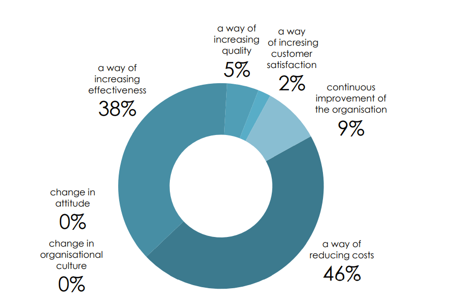
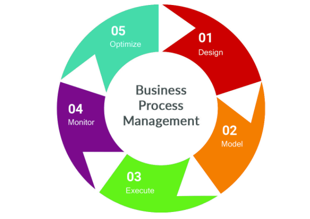

# **Process Managementes**

[https://monday.com/blog/project-management/process-management](https://monday.com/blog/project-management/process-management)

## **What exactly is process management?**

Process management: thường được gọi là [business process management (BPM)](https://monday.com/blog/project-management/bpm-software) - là việc xác định, cải tiến và quản lý các quy trình của doanh nghiệp.

Nhưng nó không phải là improvement vì lợi ích của sake.

> Mục đích của BPM là tạo ra sự rõ ràng và thống nhất về định hướng chiến lược của doanh nghiệp, sử dụng tối đa các nguồn lực của công ty và tăng năng suất trong các hoạt động và kết quả kinh doanh.

## **Why is this management system important?**

Quản lý quy trình hiệu quả có một số lợi ích cho doanh nghiệp:

- **Enables agility** ( Tăng cường sự nhanh nhẹn ): trong thị trường luôn thay đổi, các doan nghiệp cần phải duy trì sự linh hoạt để họ có thể xoay vòng hoạt động và tập hợp các hoạt động của mình.

Quản lý quy trình hoàn thiện cho phép các doanh nghiệp nhanh chóng xem xét và điều chỉnh các quy trình của họ trong thời gian thực và luôn phản ứng với các tình huống không lường trước được.

- **Promotes efficiency** (  Thúc đẩy hiệu quả ): quản lý quy trình tốt có nghĩa là liên tục theo dõi và tối ưu các quy tắc và quy trình kinh doanh.

Điều này có nghĩa là nhanh chóng xác định và giải quyết các tắc nghẽn và giảm sụ chậm trễ. Tự động hóa các quy trình làm giảm rủi ro vì nó loại bỏ khả năng xảy ra lỗi của con người.

- **Increases visibility** ( tăng khả năng hiển thị ): một phần của phương pháp quản lý quy trình hiệu quả liên quan đến việc giám sát sự tham của con người ( ví dụ: chỉ định quyền sở hữu đối với mỗi quy trình ).

Thông tin từ chủ sở hữu quy trình với dữ liệu từ tự động hóa cải thiện tính minh bạch của báo cáo và cho phép hiểu rõ kịp thời về hiệu suất hoạt động.

- **Increases revenue potential** ( Tăng tiềm năng doanh thu ): 46% công ty được khảo sát cảm thấy rằng quản lý quy trình cung cấp một lộ trình tiết kiệm và tăng doanh thu, dẫn đến chiến lược kinh doanh mạnh mẽ hơn.

[Image Source](https://www.bptrends.com/bpt/wp-content/uploads/Business_Process_Maturity_in_Polish_Organisations_2016.pdf)

Lập bản đồ các quy trình của tổ chức làm rõ nơi nào cần giảm chi phí hoặc tiết kiệm thời gian thông qua cải tiến quy trình.

Tối ưu hóa một số quy trình - chẳng hạn như thời gian bán sản phẩm - cũng có thể trực tiếp tăng doanh thu.

- **Increases employee engagement** ( tăng cường sự tham gia của nhân viên ): quản lý quy trình toàn diện bao gồm xác định các cơ hội để tự động hóa các nhiệm vụ hành chính lặp đi lặp lại. Điều này có nghĩa là nhân viên có thể tập trung vào các nhiệm vụ gia tăng giá trị cho danh nghiệp.

Cảm thấy có mục đích làm tăng mức độ gắn kết của nhân viên và giải phóng thời gian để nhân viên tập trung vào các lĩnh vực khác như phát triển của họ, tăng mức độ tham gia hơn nữa.

- **Promotes a culture of continuous improvement** ( Thúc đẩy văn hóa cải tiến liên tục ): áp dụng phương pháp quản lý quy trình hiệu quả sẽ thúc đẩy văn hóa cải tiến.

Chủ sở hữu quy trình và các nhóm nhân viên rộng lớn hơn nên được khuyến khích động não để đưa ra các ý tưởng sáng tạo nhằm tối ưu hóa quy trình và tăng năng suất và được khen thưởng khi làm như vậy.

## **What are the stages of process management?**

Có năm giai đoạn quan trọng trong vòng đời quản lý quy trình.

[Image Source](https://www.mccourier.com/business-process-management-market-recent-innovations-applications-and-growth-analysis-till-2026-ibm-corp-ricoh-microsoft-corp-oracle-corp).

### **Analyzing** ( Phân tích )

Giai đoạn phân tích là một bước quan trọng trước khi quy trình quản lý bắt đầu hoạt động.

Ở giai đoạn này, doanh nghiệp nên xác định các quy trình quản lý kinh doanh của mình và phân tích những gì họ muốn cải thiện.

Việc tổng hợp dữ liệu về mọi chỉ số hiệu suất cung cấp một dấu hiệu rõ ràng về những quy trình kém hiệu quả nhất.

Các nhà phân tích kinh doanh có thể sử dụng các phương pháp tiếp cận định tính và định lượng để thu thập dữ liệu này. Chúng có thể bao gồm phân tích giá trị gia tăng để đo lường đóng góp của mỗi quy trình cho doanh nghiệp hoặc mô hình nhân quả để xác định hiệu quả.

### **Designing/Modeling**

Trong giai đoạn tiếp theo này, quy trình hiện tại ( current process ) - hoặc trạng thái “nguyên trạng” - nên được phác thảo và thiết kế mô hình quản lý quy trình lý tưởng trong tương lai— hoặc trạng thái “hiện thực”.

Mục đích là tạo ra một chuỗi các bước hợp lý ghi lại một cách trực quan quy trình end-to-end.

Khi các bước này đã được lập thành văn bản, bạn có thể thêm thông tin bổ sung, chẳng hạn như thời gian và thời lượng của các nhiệm vụ, nơi chúng xảy ra, ai có liên quan và cách thông tin chảy qua quy trình.

Sau khi quy trình được lập bản đồ đầy đủ, người dùng cuối nên xem lại quy trình để đảm bảo tính chính xác và kiểm tra xem các cải tiến được đề xuất ở trạng thái “hiện thực” có khả năng mang lại giá trị hay không.

### **Implementing** ( Thực thi )

At the implementation — or execution — stage, the “to-be” state is adopted into the business.

Điều này có thể yêu cầu bổ sung công nghệ, cập nhật thủ tục hoặc thay đổi nguồn cung ứng, đào tạo hoặc quản lý dự án.

Nếu có thể, bạn nên thử quá trình “sắp thành công” trên một nhóm nhỏ để theo dõi tác động và khắc phục bất kỳ vấn đề mọc răng nào.

### **Monitoring** ( Giám sát )

Trong giai đoạn giám sát, quá trình “sắp xảy ra” được phép chạy tự do trong khi bạn thu thập dữ liệu về hiệu suất của nó.

Thu thập thông tin về việc liệu quá trình được thiết kế lại có hiệu quả hay không và liệu các cải tiến dự kiến ​​có được nhìn thấy hay không, do đó đạt được các mục tiêu kinh doanh.

So sánh các chỉ số có liên quan với dữ liệu cơ bản từ trạng thái “nguyên trạng” sẽ xác định xem có lợi tức đầu tư đáng giá hay không.

Dữ liệu hiệu suất cũng có thể thông báo cho các quyết định về những bước cần được thực hiện tiếp theo liên quan đến quản lý quy trình làm việc.

### **Optimizing**

Ở giai đoạn này, bạn sẽ liên tục tinh chỉnh quy trình dựa trên thông tin thu thập được trong giai đoạn giám sát và khi hoạt động kinh doanh thay đổi theo thời gian. Bạn có thể giới thiệu tự động hóa quy trình để giảm số lượng các tác vụ thủ công, lặp đi lặp lại.

Đôi khi - khi doanh nghiệp phát triển hoặc môi trường bên ngoài của nó thay đổi đáng kể - các quy trình trở nên dưới mức tối ưu hoặc quá phức tạp, dẫn đến việc tổ chức kém hiệu quả.

Trong những trường hợp này, bạn nên tạo một quy trình hoàn toàn mới để hỗ trợ các thay đổi. Điều này được gọi là  kỹ thuật lại quy trình .

## **Strategies to optimize your process management**

Quản lý quy trình cung cấp một phương pháp luận truyền thống để nhúng và cải thiện các quy trình kinh doanh của bạn. Tuy nhiên, giống như bất kỳ công cụ hoặc cách tiếp cận nào, nó có thể được áp dụng tốt hoặc áp dụng kém.

Dưới đây là năm chiến lược để tối ưu hóa việc quản lý quy trình của bạn:

### **1. Create ownership** ( Tạo quyền sở hữu )

Sau khi bạn thiết lập hoặc tối ưu hóa quy trình, điều quan trọng là phải tạo chủ sở hữu quy trình.

Chỉ định quyền sở hữu có nghĩa là có người chịu trách nhiệm nhúng quy trình mới vào doanh nghiệp và vẫn cam kết với thiết kế quy trình.

Có chủ sở hữu quy trình cũng có nghĩa là có ai đó quen thuộc với quy trình end-to-end, người có thể liên tục đánh giá nhu cầu cải tiến thêm.

### **2. Build a culture of continuous improvement** ( Xây dựng văn hóa cải tiến liên tục )

Nói về thay đổi hơn nữa, điều quan trọng là tạo ra một văn hóa cải tiến liên tục trong tổ chức.

Xét một cách nghiêm túc, điều này có thể cực kỳ có lợi cho một tổ chức, vì họ có thể tìm nguồn ý tưởng tốt từ những nhân viên gần gũi nhất với các quy trình liên quan.

Các tổ chức có thể thêm tư duy sáng tạo và giải quyết vấn đề như những kỹ năng mong muốn vào bản mô tả công việc trong quy trình tuyển dụng.

Và cần có các cơ chế phản hồi dễ thấy và dễ tiếp cận để thưởng cho các ý tưởng đổi mới và cải tiến quy trình.

### **3. Standardize repeated processes** ( Chuẩn hóa các quy trình lặp lại )

Điều quan trọng là đảm bảo rằng các doanh nghiệp chuẩn hóa và lặp lại các quy trình - chẳng hạn như mua sắm hoặc tuyển dụng.

Tiêu chuẩn hóa các quy trình làm giảm khả năng xảy ra sai sót và giảm thiểu rủi ro.

Nó cũng giúp các nhóm đa chức năng dễ dàng làm việc hiệu quả hơn và đơn giản hóa việc giới thiệu nhân viên, ngay cả khi họ di chuyển giữa các vai trò nội bộ.

### **4. Optimization before automation** ( Tối ưu hóa trước khi tự động hóa )

Thật hấp dẫn khi nghĩ rằng tự động hóa là cách nhanh chóng để cải thiện việc quản lý quy trình của bạn. Tự động hóa các công việc hành chính, lặp đi lặp lại giúp giải phóng nhân viên tập trung vào các nhiệm vụ mang lại giá trị thực sự cho doanh nghiệp.

Tuy nhiên, điều quan trọng là phải tối ưu hóa quy trình trước khi bạn tự động hóa nó. Không cần dành thời gian để xem xét và cải tiến các quy trình, tự động hóa chỉ làm cho quy trình tương tự (không hoàn hảo) chạy nhanh hơn.

Điều này, tùy thuộc vào các lỗi hoặc sự kém hiệu quả trong quy trình, có thể thực sự khiến mọi thứ trở nên tồi tệ hơn cho doanh nghiệp của bạn.

### **5. Value performance over perfection** ( Giá trị hiệu suất hơn sự hoàn hảo )

Nếu có thể, hãy tập trung vào việc cải thiện quy trình hiện có hơn là xây dựng quy trình mới. Điểm của cải tiến quy trình là thúc đẩy tăng hiệu suất, không phải để đạt được quy trình “hoàn hảo”.

Tập trung vào kết quả mong muốn khi tổ chức và sắp xếp công việc hơn là bản thân các nhiệm vụ.

Thực hiện các thay đổi nhỏ hơn và theo dõi ảnh hưởng của chúng có nghĩa là tăng giá trị sớm hơn. Đôi khi sự chậm trễ liên quan đến việc tạo ra một quy trình mới triệt để có thể làm giảm giá trị tiềm năng.

Khi bắt tay vào quản lý quy trình, bạn cần có các nguồn lực và công cụ phù hợp. dưới đây, chúng tôi đề cập đến những gì bạn cần để thành công.