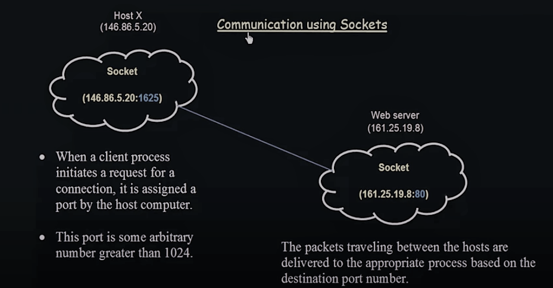

# **Sockets**

Sockets là chiến lược được sử dụng để giao tiếp giữa các processes. Nó chủ yếu được sử dụng trong các hệ thống dựa trên client-server. Khi hai hệ thống muốn giao tiếp với nhau, socket là endpoint trong hai đầu của quá trình giao tiếp.

- Một cặp quy trình giao tiếp qua mạng sử dụng một cặp ổ cắm-một cho mỗi quy trình.

> Khi hai quy trình muốn giao tiếp, cần phải có một kết nối giữa chúng và ở mỗi đầu kết nối, mỗi quy trình này sẽ sử dụng một ổ cắm, vì vậy một cặp quy trình giao tiếp qua mạng sẽ sử dụng một cặp ổ cắm cho mỗi quá trình.

### **How can we identify a socket**

Một ổ cắm được xác định bằng địa chỉ IP nối với số cổng. Máy chủ triển khai các dịch vụ cụ thể (chẳng hạn như TELNET, FTP và HTTP) lắng nghe các cổng nổi tiếng. Ví dụ:

- Máy chủ TELNET được sử dụng để ghi nhật ký từ xa lắng nghe cổng 23.

- FTP (Giao thức truyền tệp) được sử dụng để chuyển tệp máy chủ lắng nghe đến cổng 21.

- Máy chủ Web hoặc Http (Giao thức truyền siêu văn bản) lắng nghe cổng 80.

Số cổng sẽ xác định từng quy trình, dịch vụ sẽ được cung cấp.

> Tất cả các cổng dưới 1024 đều được coi là nổi tiếng; chúng ta có thể sử dụng chúng để triển khai các dịch vụ tiêu chuẩn.

### **Giao tiếp giữa các quá trình sử dụng một cặp ổ cắm này diễn ra như thế nào?**

Máy chủ đợi các yêu cầu của máy khách đến bằng cách lắng nghe một cổng được chỉ định. Sau khi nhận được yêu cầu, máy chủ chấp nhận kết nối từ ổ cắm máy khách để hoàn tất kết nối.

> Trong một hệ thống client-server, client yêu cầu thông tin từ server và server cung cấp thông tin cho client. Để client giao tiếp với server và server để liên lạc lại với client, cần phải có kết nối giữa client và server. Để thiết lập kết nối này, chúng tôi sẽ sử dụng sockets.

From the diagram above, The first part is the Host and the second part is the Web server. The first part is the Client, the second part is the Server.

- Khách hàng muốn yêu cầu một cái gì đó từ máy chủ, máy chủ phải đáp ứng yêu cầu bằng cách cung cấp bất cứ điều gì khách hàng yêu cầu từ máy chủ. Trong khác, để điều này xảy ra, phải có một liên kết giao tiếp giữa máy chủ và máy khách. Liên kết truyền thông đang được thiết lập bằng cách sử dụng khái niệm ổ cắm mà chúng tôi đã xác định trước đó.

- Từ phần đầu tiên của sơ đồ, quy trình Máy khách đang cố gắng thiết lập kết nối giữa Máy khách và Máy chủ. Máy tính chủ sẽ gán một số cổng cho quá trình này muốn giao tiếp với máy chủ.

- Địa chỉ IP của máy tính máy chủ từ sơ đồ trên là 146.86.5.20 Một quy trình thuộc về máy tính chủ muốn liên lạc với máy chủ web. Để có thể, một số cổng cụ thể sẽ được máy tính chỉ gán cho máy chủ cho quy trình máy khách. Địa chỉ IP sau đó được gán số cổng 146.86.5.20:1625:1625 Một số cổng là số tùy ý lớn hơn 1024. Nó lớn hơn 1024 vì số cổng dưới 1024 được coi là được biết đến và được sử dụng để triển khai các dịch vụ tiêu chuẩn.

- Tương tự trong phần B (Máy chủ web) máy chủ Web có một ổ cắm. socket thuộc về quy trình trong máy chủ Web sẽ giao tiếp với quy trình của Máy khách. Nó có địa chỉ IP và số cổng 161.25.19.8:80

Số cổng 80 nhỏ hơn 1024 vì đó là máy chủ Web chứ không phải máy khách. Máy khách đang cố gắng truy cập một số dịch vụ từ Máy chủ, Cổng số 80 thuộc về một dịch vụ tiêu chuẩn.

Các gói đang đi từ quy trình Máy khách đến quy trình Máy chủ được phân phối một cách thích hợp dựa trên số cổng.

Nếu một tiến trình khác từ máy tính Chủ muốn giao tiếp với cùng một ổ cắm của máy chủ Web, tiến trình đó sẽ lại được chỉ định một ổ cắm khác. Số ổ cắm sẽ là một số mới khác với 1625 và lớn hơn 1024.

### **Conclusion**

Đây là cách giao tiếp giữa các hệ thống / quy trình diễn ra bằng cách sử dụng Sockets. Đây là một chiến lược khác được sử dụng để giao tiếp giữa các tiến trình và chiến lược này được sử dụng rất đặc biệt cho hệ thống Máy khách-Máy chủ.

> Các Sockets chỉ được sử dụng đặc biệt cho các hệ thống dựa trên Máy chủ-Máy khách.