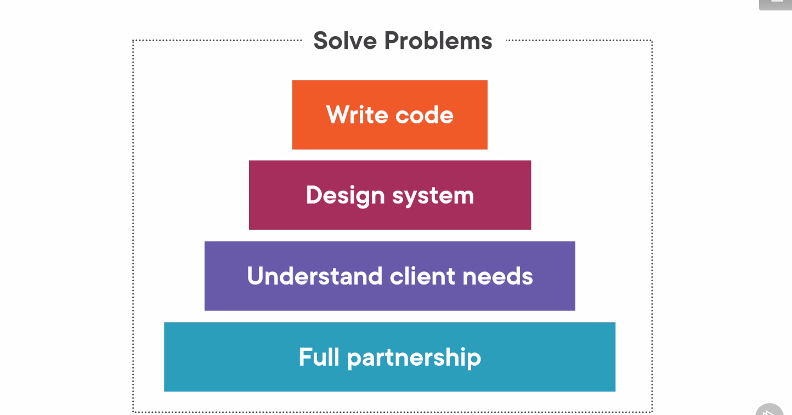
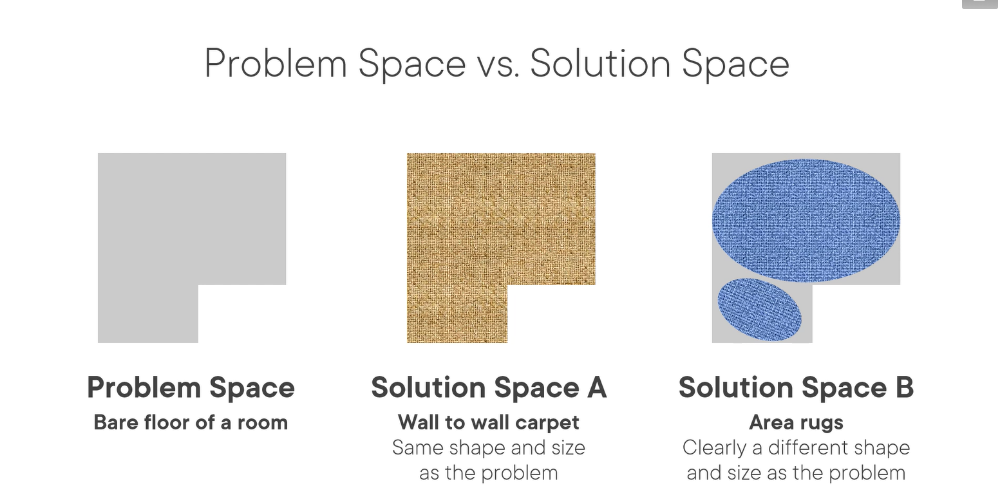
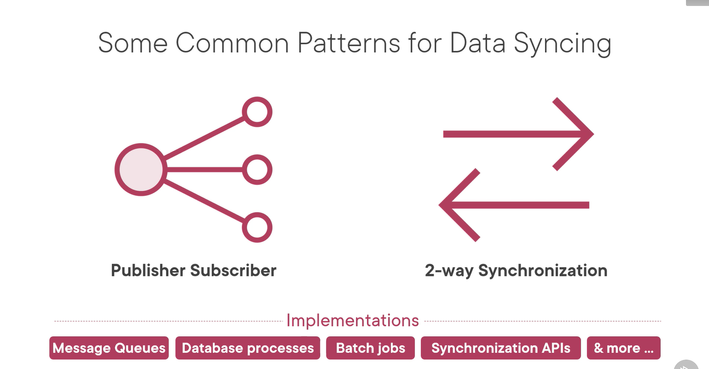
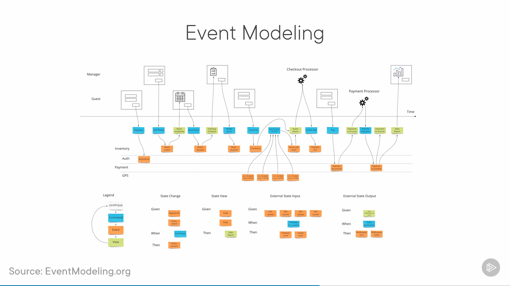
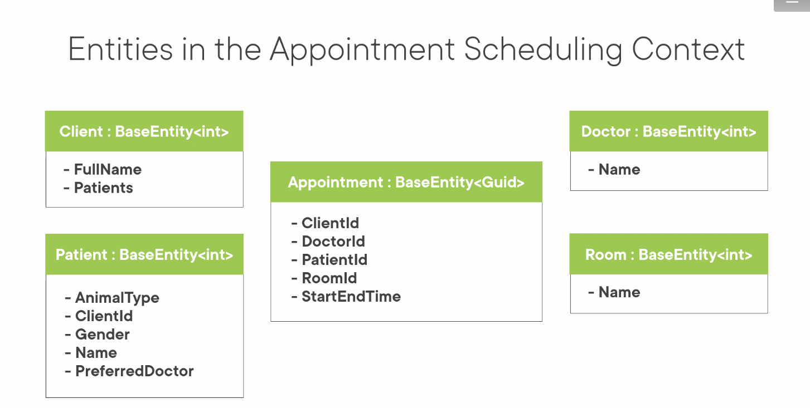
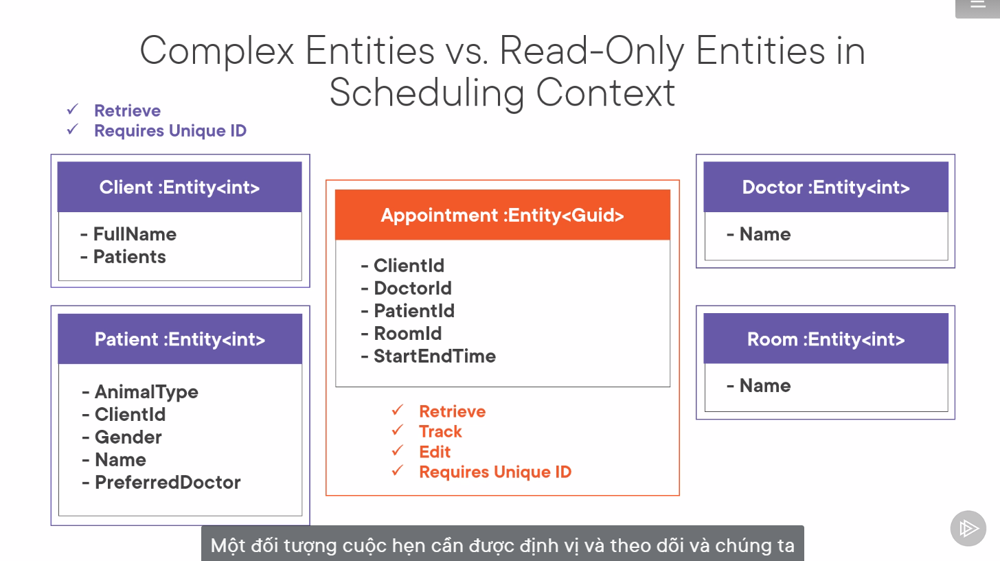
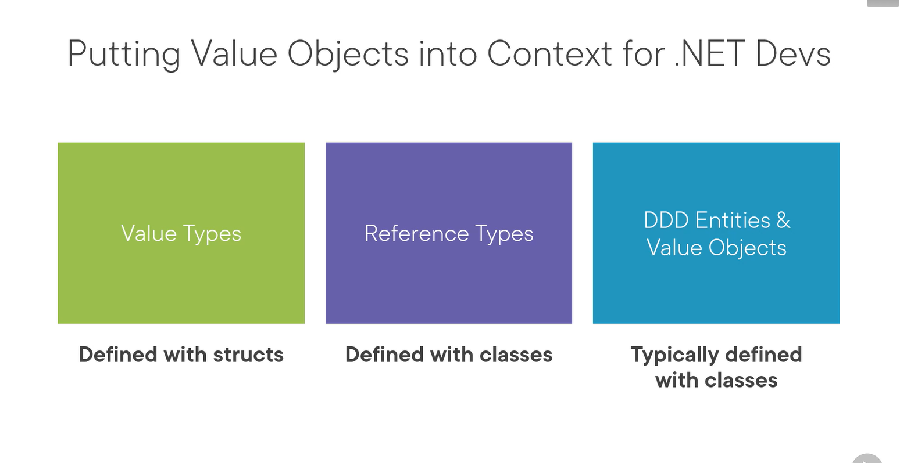
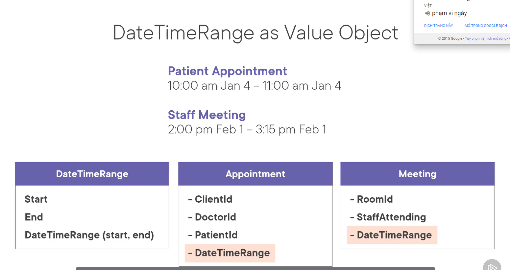
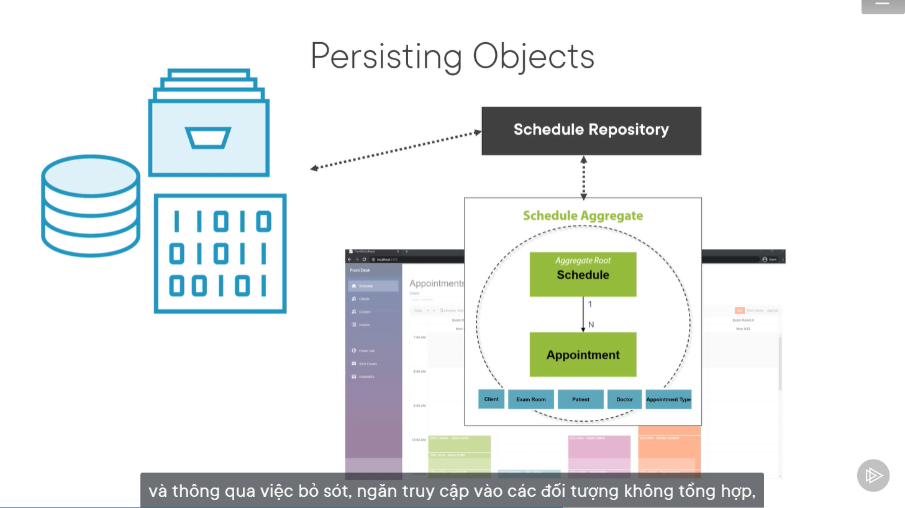
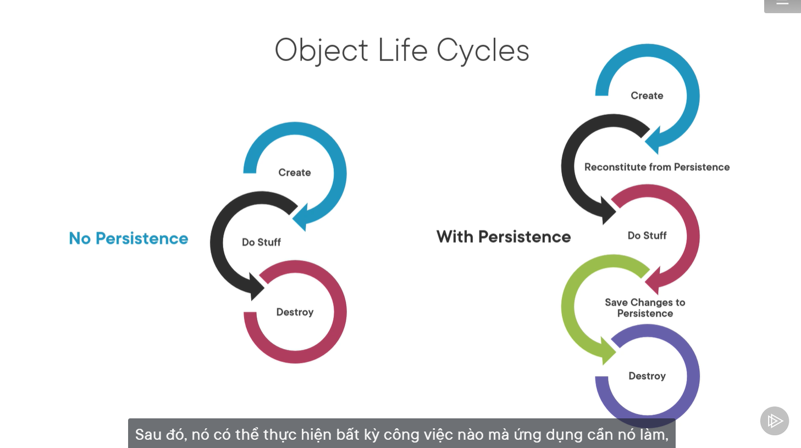

bb# 1 Domain Driven Design

## What is Domain ?

- Domain là từ được sử dụng trong bối cảnh phát triển phần mềm đề cập đến kinh doanh. Trong quá trình pt ứng dụng, domain logic hoặc business logic thường được sử dụng. Business Logic của một ứng dụng là tập hợp các quy tắc va hướng dẫn giải thích cách đối tượng kinh doanh nên tương tác với nhau để xử lý dữ liệu được mô hình hóa.

> Miền trong lĩnh vực kỹ thuật phần mềm là lĩnh vực kinh doanh mà ứng dụng được dự định xây dựng.

- Domain Driven Design nói về hai loại công cụ thiết kế, Strategic design tools (Công cụ thiết kế chiến lược) và Tactical design tools (Công cụ thiết kế chiến thuật).Các lập trình viên hoặc nhà phát triền thường đối phó với Tactical design tools

- Phần lớn các framework thuộc họ Spring được xây dựng dự trên cách tiếp cận Domain-Driven.

- **Strategic design tools:** Các công cụ này giúp ta giả i quyết tất cả vấn đề liên quan tới mô hình phần mềm. Đó là một cách tiếp cận thiết kế tương tự oob, nơi chúng ta phải suy nghĩ về các đối tượng. Theo đó, thiết kế chiến lược, chúng tôi buộc phải suy nghĩ về context.

- **Context:** : đây là một từ đề cập đến hoàn cảnh của một sự kiện, sự cố, tuyên bố hoặc ý tưởng và về mặt nào thì ý nghĩa của nó có thể được xác định. Ngoài context, thiết kế chiến lược cũng nói về Model, Ubiquitous Language, Bounded Context

  - **Model:** nó hoạt động như một logic cốt lõi và môt tả các khía cạnh được lựa chọn của miền, nó được sử dụng để giải quyết các vần đề liên quan đến doanh nghiệp đó.
  - **Ubiquitous Language:** Một ngôn ngữ chung được sủ dụng bởi tất cả các thành viên trong nhóm để kết nối tất cả các hoạt động của nhóm xung quanh mô hình domain. Hãy xem xét nó giống như sử dụng các động từ và danh từ phổ biến cho các lớp, phương thức, dịch vụ và đối tượng trong khi nói chuyện với các chuyên gia miền và các thành viên trong nhóm.
  - **Bounded Context:** Phạm vi ngữ cảnh (bối cảnh ràng buộc) có thể được xem như một ứng dụng thu nhỏ, chứa những model của chính nó và mã nguồn cùng cơ chế lưu trữ (persistence) riêng. Bên trong Phạm vi Ngữ cảnh cần có sự thống nhất hợp lý. mỗi bounded contexts nên độc lập với bất kỳ bounded contexts khác. Ví dụ trong một e-commerce system chúng ta có thể coi chương trình của chúng ta trong ngữ cảnh của cửa hàng (shopping), nhưng sâu hơn ta có thể thấy có những ngữ cảnh khác nữa ở đây chẳng hạn Hàng hóa tồn kho (Inventory), Giao nhận (Delivery) và Tài khoản (Account). Chia một ứng dụng lớn trong những bối cảnh hợp lý khác nhau sẽ cho chúng ta khả năng module hóa hệ thống, sẽ giúp ta phân tách mối quan tâm khác nhau vào những phần riêng biệt và làm cho các ứng dụng dễ dàng để quản lý và nâng cấp. Quá trình thiết kế chiến thuật xảy ra trong giai đoạn phát triển sản phẩm.

  Hãy thảo luận về một số công cụ thiết kế chiến thuật quan trọng. Những công cụ này là các khái niệm cấp cao có thể được sử dụng để tạo và sửa đổi các **Domain Model**.
  - **Entity:**
  - **Object Value:** Đây là các đối tượng bât biến (k bao giờ thay đổi), trọng lượng nhẹ, k có bất kỳ danh tính nào. Các object value làm giảm độ phức tạp bằng cách thực hiện các phép tính phức tạp, cô lập logic tình toán nặng khỏi các thực thể.</br>
  </br>
  Trong hình ảnh trên User là một Entity và Address là một Object-Value, address có thể thay đổi nhiều lần nhừng danh tính user thì không bao giờ thay đổi. Bất kỳ khi nào một Address được thay đổi thì một Address mới sẽ được khởi tạo và gán cho User
  - **Service**
  - **Aggregates**: Tạo ra sự nhất quán trong dữ liệu. Ví dụ có Entity User, khi xóa User thì các Entity khác được liên kết với User sẽ không được sử dụng. Có thể liên hệ tới các mối quan hệ trong database.
  - **Factories and Repositories**: 2 công cụ này được sử dụng để xử lý **Aggregates**. Các Factories giúp quản lý thời điểm bắt đầu vòng đời của các Aggregates trong khi Repositories giúp quản lý giữa và cuối vòng đời của Aggregates

- **Tactical design tools:** thiết kế chiến thuật nói về chi tiết triển khai, tức là miền mô hình hóa. Nó thường chăm sóc các thành phần bên trong một bối cảnh ràng buộc. Chúng là Service, Entity, Repository và Factories.

- Ưu điểm của Domain Driven Design
  - Cải thiện nghề của chúng tôi
  - Cung cấp sự linh hoạt
- Nhược điểm

# 2 Intrucing Domain-Driven Design

## 2.3 Understaning the Value of Domain-Driven Design

> Domain-Driven Design is an approach to software devlopment that centers the development on programming a domain model that has a richunderstanding of the processes and rules of a domain.
> </br>**Martin Fowler**

Value Proposition of DDD (Đề xuất giá trị của DDD)

- Principles & patterns to **solve difficult problems** (Các nguyên tắc và mô hình để giải quyết các vấn đề khó khăn)
- History of **success with complex projects**
- Aligns with practices from our own experience
- Clear, readable, testable code that pepresents the domain



Tackling complexity in the heart of software (Giải quyết sự phức tạp trong trung tâm của phần mềm)

## 2.4 Exploring the Benefits and Potential Drawbacks of DDD

#### Benefits of Domain-Driven Design

- Flexible (Linh hoạt)
- Customer's vison/perspective of the problem (Tầm nhìn / quan điểm của khách hàng về vấn đề)
- Path through a very complex problem (Con đường vượt qua một vấn đề rất phức tạp)
- Well-organized and easily tested code (Mã được tổ chức tốt và dễ dàng kiểm tra)
- Business logic lives in one place (Logic kinh doanh đều tồn tại ở một nơi)
- Many great patterns to leverage (Nhiều mô hình tuyệt vời để tận dụng)

#### Be Prepared for Time and Effort

- Discuss and model the problem with domain experts (Thảo luận và lập mô hình vấn đề với các chuyên gia miền)
- Isolate domain logic from other parts of application (Cách ly logic miền khỏi các phần khác của ứng dụng)

#### Inspecting a Mind Map of Domain-Driven Design


## 2.5 Introduction Our Sample Application

## 2.6 Exploring the sample app's high-level structure

DEMO: <https://github.com/ardalis/pluralsight-ddd-fundamentals.git>

# 3 Modeling Problems in Software

## 3.1 Overview

- Breaking up the veterinary office domain
- The importtance of the domain experts
- A play! (Discovering the domain)
- Core elements of a domain model
- Subdomains and bounded contexts (Tên miền phụ và các ngữ cảnh bị ràng buộc)
- That ubiquitous tern: ubiquitous languages (Đó là ngôn ngữ phổ biến: ngôn ngữ phổ biến)

## 3.2 Introduction Our Domain

- Our domain: A Veterinary Practice (Thực hành thú y)
- More than just caring for pets
  - Schedule: lập lịch
  - Invoices: hóa đơn
  - Payment: thanh toán
  - Records: lưu trữ và truy xuất hồ sơ y tế
  - External Resources: thí nghiệm bên ngoài

## 3.3 Planning Ahead to Learn About the Domain (Lập kế hoạch trước khi tìm hiểu ...)

### Our goals for learning about the domain (Mục tiêu của chúng tôi là tìm hiểu về miền)

- Understand client's business
- Identify processes beyond project scope (Xác định các quy trình ngoài phạm vi dự án)
- Look for subdomain we should include (Tìm tên miền phụ mà chúng ta nên đưa vào)
- Look for subdomain we can ignore (Tìm tên miền phụ mà chúng ta có thể bỏ qua)

## 3.4 Conversation with a Domain Expert: Exploring the Domain and Its Subdomains

Trò chuyện với chuyên gia miền: Khám phá miền và các miền phụ của miền đó

### Learning about the Complete Domain (Tìm hiều về miền hoàn chỉnh)

- Patient scheduling (Lên lịch cho bệnh nhân)
- Owner and pet data management (Quản lý dữ liệu chủ và vật nuôi)
- Surgery scheduling (Lên lịch phẫu thuật)
- Office visit data collection (Thu thập dữ liệu chuyến thăm văn phòng)
- Billing (External?)
- Sales and Inventory (Bán hàng và hàng tồn kho)
- Lab testing (Schedule, results, bill)
- Prescription (Đơn thuốc)
- Staff scheduling (Nhân viên lên lịch)
- CMS (Content Management System: Hệ thống quản lý nội dung)

### So Many Problems to Solve (Rất nhiều vấn đề cần giải quyết)

### -> Some of the Identified Subdomains

- Staff (Nhân viên)
- Accounting (Kế toán)
- Client and patient records (Hồ sơ khách hàng và bệnh nhân)
- Visit records (Truy cập hồ sơ)
- Appointments Scheduleing (Lên lịch cuộc hẹn)
- Sales (Việc bán hàng)

## 3.5 Conversation with a Domain Expert: Exploring the Scheduling Subdomain

Trò chuyện với chuyên gia miền: Khám phá miền phụ lập lịch

## 3.6 Using Bounded Context to Untangle Concepts that Appear to Be Shared

Sử dụng ngữ cảnh bị ràng buộc để gỡ rối các khái niệm dường như được chia sẻ

> Expliciitly define the context within which a model applies... Keep the model strictly consistent within these bounds, but don't be distracted or confused by issues outside.</br>
**Eric Evans**

## 3.7 Conversation with Eric Evans on Subdomains and Bounded Contexts

- Subdomain: is a problem space concept
- Bounded Context: is a solution space concept

### Problem space and Solution space


Ở ví dụ trên

- (Hình 1) The room là một không gian có vấn đề, vì vậy nó giống như một miền phụ.
- (Hình 2) Bạn có thể lắp một tấm thảm tường phù hợp với hình dạng của căn phòng một cách hoàn hảo, điều này giống như khi miền phụ và ngữ cảnh bị giới hạn bao gồm cùng một thứ.
- (Hình 3) Nhưng, bạn có thể chỉ sử dụng một số thảm khu vực để trải sàn và thảm khu vực giải quyết được vấn đề. Chúng che phủ một phần sàn nơi bạn đi lại. Điều này giải quyết được vấn đề tuy nhiên nó không khớp với hình dạng của căn phòng

## 3.8 Introducing Context Maps

- Context Map: demonstrates how bounded context connect to one another while supporting communication between teams. (thể hiện cách ngữ cảnh có giới hạn kết nối với nhau trong khi hỗ trợ giao tiếp giữa các nhóm)


- Ta sẽ có 2 context là Application Scheduler và Billing
- Mỗi context sẽ có database riêng
- Và dùng Shared kernel để chia sẻ những mối quan tâm xuyên suốt



## 3.9 Specifying Bounded Context in our Application

## 3.10 Reviewing Important Concepts from This Module

- Problem Domain: The specific problem the software you're working on is trying to solve. (Vấn đề cụ thể mà phần mềm bạn đang làm việc đang cố gắng giải quyết)
- Core Domain: The key difference for the custemer's business something they must do well and cannot outsource. (Điểm khác biệt quan trọng đối với hoạt động kinh doanh của người bán hàng là họ phải làm tốt và không thể thuê ngoài).
- Subdomains: Separate application or features your software must support or interact with. (Ứng dụng hoặc tính năng riêng biệt mà phần mềm của bạn phải hỗ trợ hoặc tương tác với)
- Bounded Context: A specific responsibility, with explicit boundaries that separate it from other parts of the system. (Một trách nhiệm cụ thể, có ranh giới rõ ràng ngăn cách nó với các phần khác của hệ thống)
- Context Mapping: the process of identifying bounded contexts and their relationships to one another. (Quá trình xác định các bối cảnh bị ràng buộc và mối quan hệ của chúng với nhau)
- Shared Kernel: Part of the model that is shared by two or more teams, who agree not to change it without collaboration. (Một phần của mô hình được chia sẻ bởi hai hoặc nhiều nhóm, những người đồng ý không thay đổi mô hình mà không có sự cộng tác).

# 4 Elements of a Domain Model

- The domain layer in your software
- Focusing on behviors in a model
- Rich domain models vs. anemic domain models
- Entity in a domain model
- Different entities with complex needs from those needing only CRUD

## 4.1 The important of Understanding DDD terms

Entity & Context are Common Software Terms

|  | Entity Framework Core | Domain-Driven Design |
|---|---|---|
|Entity| Một class model data với một key được ánh xạ tới một bảng trong cơ sở dữ liệu | Một domain class có danh tính (identity) để theo dõi
|Context|Một DbContext class cung cấp quyền truy cập vào các yêu cầu và xác định cách các entities ánh xạ tới cơ sở dữ liệu|Một Bounded Context xác định phạm vi và ranh giới của một subnet của một domain|

- Object-sValue:

## Tập trung vào Domain

- Chuyển tư duy từ DB-Driven sang Domain-Driven
  - Thiết kế phần mềm dựa trên nhu cầu lưu trữ dữ liệu
  - Thiết kế phần mềm dựa trên nhu cầu kinh doanh

> The Domain Layer chiệu trách nhiệm đại diện cho các khái niệm về doanh nghiệp, thông tin về tình hình kinh doanh và các quy tắc kinh doanh. Trạng thái phản ánh tình hình kinh doanh được kiểm soát và sử dụng ở đây, mặc dù các chi tiết kỹ thuật của việc lưu trữ nó được ủy quyền cho cơ sở hạ tầng. Layer này của domain là trái tim của business software

### Tập trung vào hành vi (behaviors), không phải thuộc tính

- Ví dụ về hành vi
  - Lên lịch một cuộc hẹn để kiểm tra sức khỏe
  - Đặt phòng
  - Tạo một mục lịch trình trên lịch của bác sĩ.
  - Vì vậy lên lịch cuộc hẹn không đơn giản chỉ là thiết lập các thuộc tính của đối tượng liên quan, thời gian hẹn và danh tính của vật nuôi mà chúng ta đang đặt lịch hẹn. Thay vào đó chúng ta đang nói về cách hệ thống hoạt động để đáp ứng với việc sắp xếp một cuộc hẹn. (Bên dưới là các tính năng được bổ sung khi suy nghĩ theo hướng hành vi)
  - Note trọng lượng vật nuôi
  - Gửi yêu cầu tới phòng lab
  - Thông báo cho chủ nhân
  - Châp nhận bệnh nhân mới

### Xác định các event dẫn đến hiểu các behaviors

- Ví dụ về hành vi as Event



## 4.4 So sánh Anemic and Rich Domain Models

- Domain Model Types
  - Anemic: là mô hình miền tập trung vào trạng thái của các đối tượng của nó (Nếu CURD là đủ thì có thể dùng)
    - **Nhận biết Anemic Model**: Triệu chứng cơ bản của một mô hình thiếu máu là lúc đầu nó trông như thật. Có những đối tượng được đặt tên theo danh từ trong domain namespace và những đối tượng này được kết nối với các mối quan hệ về cấu trúc phong phú mà các mô hình miền thực sự có.
    - Lợi ích khi bạn nhìn vào hành vi và bạn nhận ra rằng hầu như không có bất kỳ hành vi nào trên những vật thể này khiến chúng không chỉ là những túi nhỏ với setters và getterss.
    - Thật vậy các mô hình này thường đi kèm với các quy tắc thiết kế nói rằng bạn không được đặt bất kỳ domain logic nào vào các đối tượng miền. Thay vào đó có một tập hợp các đối tượng service sẽ nắm bắt tất cả logic domain
  - Rich: Các rich domain models sẽ đại diện cho các hành vi và logic kinh doanh của miền của bạn, các lớp chỉ ảnh hưởng đến trạng thái được coi là một mô hình chống đối trong một số mô hình miền và do đó nhận được cái mác khó chịu là Anemic. Mặc dù chúng hoàn toàn ổn trong model CRUD

## 4.5 Hiểu Entities

### 2 loại đối tượng trong DDD

- Được xác định bởi một identity (danh tính) - Entity
- Được xác định bởi các value của nó

### Entites có danh tính và có thể thay đổi





# 5 Understanding Value Object & Service in The Model

## 5.1 Getting Acquainted With Value Object (Làm quen với Object-Value)

- Nó là một đối tượng được sử dụng để do lường, định lượng hoặc mô tả một cái gì đso trong miền của bạn.
- Thay vì có một khóa nhận dạng, danh tính của nó dựa trên thành phần của các giá trị của tất cả thuộc tính của nó, bởi vì các giá trị thuộc tính xác định một đối tượng giá trị
- Nó phải là bất biến.
- So sánh bằng cách sử dụng tất cả các giá trị
- Các Object-Value có thể có methods và behavior nhưng chúng không bao giờ có tác dụng phụ

### Đưa Value-object vào context cho nhà phát triển .net



### Recognizing Commonly Used Value-object (Nhận biết đối tượng giá trị thường được sử dụng)

- String is a value-object: String methods tôn trọng tính bất biến
  - Replace(strA, strB): **return a new string**
  - ToUpper(): **return a copy** của string này được chuyển thành chữ hoa
  - ToLower(): **return a copy** ...
- Money is a great value object
- DateTimeRange as value object



### When Considering Domain Object

- Our Instinct
  - 1. Probably an entity
  - 2. Maybe a value object

## 5.4 Getting More Insight from Eric Evans and Vaughn Vernon

### Explicit ID value Objects instead of Ints/GUIDs (Giá trị ID rõ ràng Đối tượng thay vì Ints / GUIDa)

## 5.7 Review and Resources

- Domain-Driven Design in c#9: Immutable Value Objects: <https://www.pluralsight.com/blog/software-development/domain-driven-design-csharp>
- Support for Value Objects: ardals.com/support-for-value-objects-in-csharp
- Vaughn Vernon Website: <https://www.hugedomains.com/domain_profile.cfm?d=ardals.com>
- Eric Evans Website <https://www.domainlanguage.com>

# 6 Tackling Complexity With Aggregates (Giải quyết sự phức tạp với Aggregate)

## 6.3 Introduction Aggregates and Aggregate Roots

### Các thay đổi dữ liệu với Aggregates phải tuân theo ACID

- **A**tomic: Nguyên tử
- **C**onsistent: Nhất quán
- **I**solated: Cô lập
- **D**urable: Bền chặt

### Aggregates Roots chịu trách nhiệm duy trì các yếu tố bất biến

- Aggregates là một cụm (cluster) các đối tượng liên kết mà chúng ta coi như một đơn vị nhằm thay đổi dữ liệu

## 6.13 Review and Resources

### Key Terms from this Module

- Aggregate: Là một nhóm các đối tượng liên quan hoạt động cùng nhau trong một transactional
- Aggregate Root: Là entry point (điểm vào) mà qua đó bạn thực hiện bất kỳ công việc nào với aggregate, và root cũng là nơi chịu trách nhiệm đảm bảo rằng tất cả các rule áp dụng co biểu đồ đối tượng đo đều được đáp ứng
- Invariant: Một điều kiện luôn đúng để hệ thống ở trạng thái nhất quán
- Associations: Là một Modeled relationship giữa các entities
- Navigation Properties: Một thuật ngữ ORM để mô tả các thuộc tính tham chiếu đến đối tượng liên quan
- Unidirectional Relationships: (Mối quan hệ một chiều) Associations giữa hai thực thể chỉ có thể được điều hướng trong một thao tác

### Key Takeaways (Những điều quan trọng)

- Avoid big ball of mud models
- Break the model up into aggregates (Chia model thành các aggregates)
- An aggregate represents a graph of objects in a transaction (một tổng thể đại diện cho một đồ thị của các đối tượng trong một giao dịch)
- Aggregates encapsulate business rules and invariants (Tổng hợp đóng gói các quy tắc kinh doanh và các bất biến)
- One-way relationships when modeling associations

# 7 Working with Repositories

- Define Repositories
- Tips for designing repositories
- Benefits of repositories
- Pros and cons of interfaces and generic repos
- Specification pattern to aid repositores
- Repository implementations in our app

## 7.2 Instroducing Repository

### Persisting Object



### Object life cycle

]


- Có thể sử dụng Repository để quản lÝ vòng đời của các persisted object.

- Chúng tôi gọi các đối tượng này là **Persistence Ignorance**
- Business Object không có logic nào liên quan đến cách dữ liệu được lưu trữ và truy xuất.

## 7.3 Repository Benefits (Lợi ích của repositories)

- Cung cấp khái niệm trừu tương chung cho tất cả các mối quan tâm về persistence.
- Promotes separation of concerns (Thúc đẩy tách biệt các mối quan tâm), cả logic domain và interfaces đều có thể thay  đổi độc lập với dữ liệu trong nguồn dữ liệu được ứng dụng sử dụng.
- Truyền đạt các quyết định thiết kế, chỉ một số đối tượng nhất định mới được truy cập  trực tiếp do đó repository cung cấp và kiểm soát quyền truy cập này.

## 7.4 Repository Tips

- Think of it as an in-memory collection (Hãy coi nó như một bộ sưu tập trong bộ nhớ)

- Implement một common access interface

  ```csharp
  public interface IRepository<T> {
    T GetById(int id);
    void Add (T entity);
    void Remove (T entity);
    void Update (T entity);
    INumerable<T> List();
  }
  ```

- Include methods to add and remove

```csharp
public void Insert(TEntity entity) {
  _db.Add(entity);
  _context.SaveChanges();  
}

public void Delete(int id) {
  var entityToDelete = _dbSet.Find(id);
  _db.Remove(entityToDelete);
  _context.SaveChanges()
}
```

- Custom Query Implementation using EF core

```csharp
public Schedule GetScheduleForDateWithAppointments(int clincId, DateTimeOffset date) {
  var endDate = date.AddDays(clincId);
  var schedule = _dbContext.Set<Schedule>().Include(s => s.Appointments.Where(a => a.TimeRange.Start > date && a.TimeRange.End < endDate)).FirstOrDefault(schedule => schedule.CincId == clincId);
  return schedule;
}
```

- Get a Client with Their Patients

```csharp
public Client GetClientByIdWithPatients(int clincId){
  var client = _dbContext.Get<Client>().Include(e => e.Patients).FirstOrDefault(client => client.Id == clincId);

  return client;
}
```

## 7.5 Avoiding Repository Blunders (Tránh sai lầm về kho lưu trữ)
