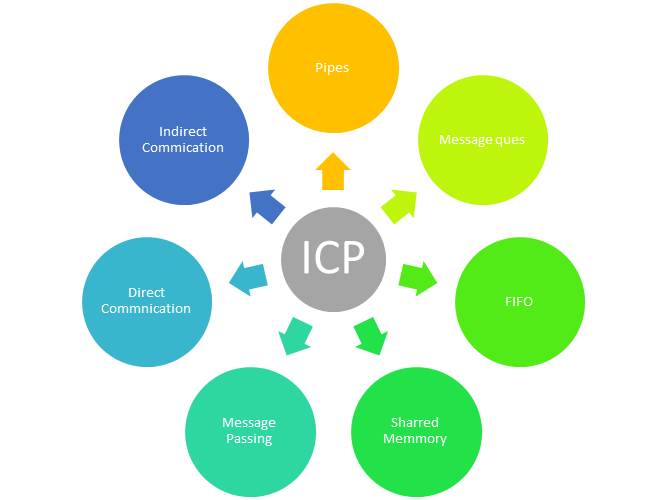

# Inter Process Communication (IPC) in OS

# IPC

- IPC được sử dụng để trao đổi dữ liệu giữa nhiều luồng trong một hoặc nhiều quy trình hoặc chương trình.

# Các phương pháp tiếp cận để giao tiếp giữa các quy trình

## Pipe

Được sử dụng rộng rãi để giao tiếp giữa hai quá trình liên quan. Đây là một phương pháp nửa full-duplex, vì vậy quá trình đầu tiên giao tiếp với quy trình thứ 2. Tuy nhiên, để đặt được một full-duplex, một đường ống khác là cần thiết.

## Message Passing

Là một cơ chế cho một quá trình để giao tiếp và đồng bộ hóa. Sử dụng truyền tin nhắn, quá trình giao tiếp với nhau mà không cần dùng đến các biến được chia sẻ.

Cơ chế IPC cung cấp hai hoạt động:
    - Send (message) - message size fixed or variable (gửi)
    - Received (message) (nhận)

## Message Queues

Hàng đợi tin nhắn là một danh sách các tin nhắn được liên kết và lưu trữ trong kernel. Nó được xác định bởi một định danh hàng đợi tin nhắn. Phương pháp này cung cấp giao tiếp giữa một hoặc nhiều quy trình với dung lượng full-duplex đầy đủ.

## Direct Communication (Giao tiếp trực tiếp)

Trong loại quy trình giao tiếp giữa các quy trình này, nên đặt tên cho nhau một cách rõ ràng. Trong phương pháp này, một liên kết thiết lập giữa một cặp quy trình giao tiếp và giữa mỗi cặp, chỉ có một liên kết tồn tại.

## Indirect Communication (Truyền thông gián tiếp)

Giao tiếp gián tiếp chỉ thiết lập giống như khi các quy trình chia sẻ một hộp thư chung, mỗi cặp quy trình chia sẻ một số liên kết giao tiếp. Một liên kết có thể giao tiếp với nhiều quy trình. Liên kết có thể là hai chiều hoặc một chiều.

## Shared Memory (Bộ nhớ dùng chung)

Bộ nhớ dùng chung là bộ nhớ chia sẻ giữa hai hoặc nhiều quy trình được thiết lập bằng cách đồng bộ hóa quyền truy cập trên tất cả các quy trình.

## FIFO

Giao tiếp giữa hai quá trình không liên quan. Đây là một phương pháp full-duplex đầy đủ, có nghĩa là quá trình đầu tiên có thể giao tiếp với quy trình thứ hai và điều ngược lại cũng có thể xảy ra

# Tại sao chọn IPC?

- Giúp tăng tốc độ module
- Tính toán
- Tách đặc quyền
- Thuận tiện
- Giúp hệ điều hành giao tiếp với nhau và đồng bộ hóa các hành động của họ

# Các thuật ngữ được sử dụng trong IPC

- Semaphores: làm một kỹ thuật cơ chế tín hiệu. Phương pháp OS này cho phép hoặc không cho phép truy cập tài nguyên, điều này phụ thuộc vào cách nó được thiết lập.
- Signals (tín hiệu): Nó làm một phương pháp để giao tiếp giữa nhiều quá trình bằng cách báo tín hiệu. Quá trình nguồn sẽ gửi một tín hiệu được nhận dạng bằng số và quá trình đích sẽ gửi nó.

# What is Like FIFOS and Unlike FIFOS

|Like FIFOS| Unlike FIFOS|
|--|--|
|Nó tuân theo phương pháp FIFO|Phương pháp gửi các thông điệp khẩn cấp cụ thể trước khi chúng điến được phía trước|
|FIFO tồn tại độc lập với cả quá trình gửi và nhận.|Luôn sẵn sàng, vì vậy không cần mở hoặc đóng.|
|Cho phép chuyển dữ liệu giữa các tiến trình không liên quan.|Không có bất kỳ vấn đề đồng bộ hóa giữa mở và đóng.|
